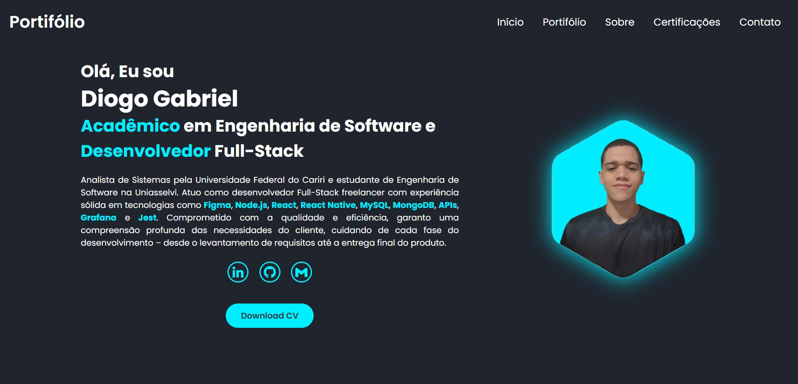

## Olá! Eu sou o Diogo Gabriel 👋
### Desenvolvedor FullStack | Freelancer apaixonado por inovação e soluções escaláveis.
Sempre em busca de novos desafios, com foco em criar aplicações eficientes, ágeis e de fácil manutenção.

    

## Tecnologias 💻
Trabalho com uma variedade de tecnologias modernas, como:

    
    
    
    
    
    
    
    
    
    

## Portifólio 🚀

Confira meu portifólio clicando <a href="https://diogog-dev.github.io/Portifolio/">aqui!</a>

## Principais Projetos 🌟
- <a href="https://github.com/DiogoG-dev/BatmanPage">BatmanPage</a> 
Uma página interativa dedicada a venda de ingressos do filme The Batman (2022).
- <a href="https://github.com/DiogoG-dev/SisGeps_Mobile">SisGeps</a> 
Aplicativo móvel de gerenciamento de estoque para supermercados, desenvolvido em equipe.
- <a href="https://github.com/DiogoG-dev/API-Food_Inventory_Manager">Gerenciador de Estoque</a> 
API de produtos para o gerenciamento de estoque.

## Redes e Contatos 📱
Vamos conversar? Encontre-me nas minhas redes sociais ou envie um email.

    
    
    
    

